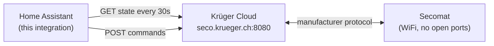

# Krüger Secomat - Home Assistant Integration

<p align="center">
  
</p>

<p align="center">
  <a href="https://github.com/xenofex7/ha-kruger-secomat/tags"></a>
  
  
  
  
  
</p>

Home Assistant custom integration for the Krüger Secomat WiFi dehumidifier. Exposes sensors, switches, a moisture-target select and a manual-start button via the Krüger Cloud API. Cloud-polled at 30-second intervals, no local device communication required (the device has no open ports).

## Features

**Controls**
- Laundry Drying switch (auto mode)
- Room Drying switch
- Start Manual Drying button (immediate start)
- `secomat.start_drying` service with optional `delay_seconds` (0-86400, scheduled start for automations)
- Target Moisture select (very_dry / dry / medium / moist)
- Moisture Lock switch (matches the app's lock; the moisture select is hidden when locked)

**Sensors**
- Temperature, Humidity
- State (ready / starting / drying / drying_high)
- Operating Mode (standby / no_program / laundry_program)
- Target Moisture (current setting, also exposed for automations)
- Next Start (timestamp of scheduled start, diagnostic)
- Error Count with active error list (diagnostic)
- Firmware (diagnostic)
- Device Tick (diagnostic, disabled by default)

**Binary sensors**
- Eye Detects Object (proximity / laundry detection)
- Display Backlight (diagnostic)
- Problem (on when an error is active, diagnostic)

## Requirements

- Home Assistant 2024.x or newer
- Krüger Secomat WiFi dehumidifier
- Claim token from the Secomat mobile app (see [Installation](#installation))
- HACS (recommended for installation and updates)

## Installation

### HACS (recommended)

1. Add this repository as a custom repository in HACS (category: Integration)
2. Install "Krüger Secomat"
3. Restart Home Assistant

### Manual

1. Copy `custom_components/secomat/` to your HA `custom_components/` directory
2. Restart Home Assistant

After installation, see [Configuration](#configuration) to add the integration.

## Updating

- HACS: open HACS, update the integration, restart Home Assistant
- Manual: replace the `custom_components/secomat/` directory with the new version and restart

## Configuration

### Add the integration

1. Settings → Devices & Services → Add Integration
2. Search for "Krüger Secomat"
3. Enter your claim token (see below)

### Obtaining the claim token

The Secomat device has no open ports, so the integration talks to the Krüger Cloud API on your behalf. Authentication uses a `claim-token` header that the official mobile app sends with every request. Intercept it once with mitmproxy:

1. Install mitmproxy on a computer in your local network:
   ```bash
   sudo apt install mitmproxy
   ```
2. Start mitmproxy with increased file limits:
   ```bash
   sudo bash -c 'ulimit -n 65536 && mitmdump --listen-port 8888 --ssl-insecure'
   ```
3. On your phone, set a manual HTTP proxy: server = your computer's IP, port = 8888 (WiFi settings → Proxy → Manual).
4. Open `http://mitm.it` on the phone and install the mitmproxy CA certificate. On iOS: Settings → General → About → Certificate Trust Settings → enable mitmproxy.
5. Open the Secomat app and interact with it for a few seconds.
6. In the mitmdump log, find requests to `seco.krueger.ch:8080`. The `claim-token` header value is your token.
7. Disable the manual proxy on the phone.

Treat the token like a password: it grants full control over your device. Home Assistant stores it encrypted at rest in the config entry.

## How it works



The device has no open ports and no documented local API. The official Secomat app talks to a cloud endpoint at `seco.krueger.ch:8080`; this integration replays the same HTTP requests. Authentication is a static `claim-token` header that you extract once from the app (see [Obtaining the claim token](#obtaining-the-claim-token)).

State is polled every 30 seconds; commands are fire-and-forget with an immediate state refresh after each success. See [docs/API.md](docs/API.md) for the full command list and field reference.

## Development

```bash
git clone https://github.com/xenofex7/ha-kruger-secomat.git
cd ha-kruger-secomat
python3 -m venv .venv
source .venv/bin/activate
pip install aiohttp
```

`test.py` is a standalone API client for hitting the cloud without Home Assistant - useful for reverse-engineering and verifying commands on a real device.

```bash
# Token from .env (SECOMAT_TOKEN=...) or first argument
python3 test.py                  # current state
python3 test.py -i               # interactive command tester
python3 test.py --new-commands   # guided verification of PR #1 commands
```

## Credits

- [@alexef](https://github.com/alexef) reverse-engineered the `PRG_WASH_MANUAL_ON` command and contributed the initial button and select platforms (PR #1).
- [@ratsch](https://github.com/ratsch/ha-kruger-secomat) reverse-engineered the `PARAMETER_CHANGE` command for moisture target and lock, and the `PRG_WASH_MANUAL_OFF` cancel command.

## License

MIT.
